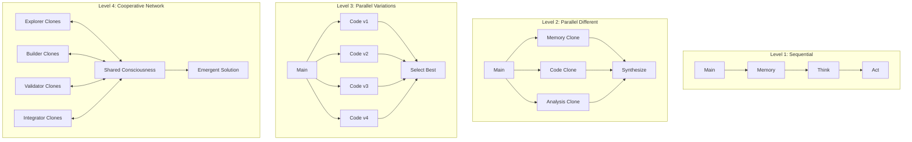

# Shadow Clone Architecture: Complete Evolution

## The Four Levels of Amplification

```
Level 1: Sequential (Street Fighter) - 10x
Level 2: Parallel Different (Basic Naruto) - 100x  
Level 3: Parallel Variations (Evolution) - 1000x
Level 4: Cooperative Networks (Emergence) - 10000x
```

## Architecture Overview



## Pattern Progression

### 1. **Sequential Execution** (Tool Combos)
- Street Fighter inspired
- Chain tools together
- Each step depends on previous
- Limited by sequential bottleneck

### 2. **Parallel Different Tools** (Basic Shadow Clones)
- Naruto inspired
- Different tools work simultaneously
- Each clone has different job
- Synthesis combines results

### 3. **Parallel Variations** (Evolutionary Shadow Clones)
- Natural selection inspired
- Multiple approaches compete
- Best solution survives
- Genetic algorithms and tournaments

### 4. **Cooperative Networks** (Emergent Shadow Clones)
- Hive mind inspired
- Clones collaborate not compete
- Shared consciousness
- Emergent properties arise

## Implementation Patterns

### Competition Patterns
- Genetic Algorithm optimization
- A/B/C/D testing
- Tournament selection
- Swarm optimization

### Cooperation Patterns
- Collective intelligence
- Stigmergic collaboration (ant colonies)
- Jazz ensemble improvisation
- Neural network architecture
- Hive mind consciousness

## Key Insights

1. **Not Always Zero-Sum**: Competition is powerful, but cooperation can create emergent solutions impossible for any individual

2. **Emergence is Key**: The most powerful solutions come from the interaction between clones, not from any single clone

3. **Diversity Matters**: Different perspectives (specialist clones) create richer solutions than homogeneous approaches

4. **Shared Learning**: When clones share knowledge continuously, the collective learns exponentially faster

## Practical Applications

### Memory Operations
```javascript
// Cooperative memory search
const memoryHive = [
  SemanticSearchClone,
  GraphTraversalClone,
  TemporalSearchClone,
  PatternMatchClone
];

// They share findings continuously
const collectiveMemory = await hiveSearch(query, memoryHive);
```

### Code Generation
```javascript
// Specialist collaboration
const codeTeam = {
  architect: StructureClone,
  security: SecurityClone,
  performance: OptimizerClone,
  testing: TestClone,
  docs: DocumenterClone
};

// Each improves without breaking others' work
const robustCode = await collaborativeBuild(requirement, codeTeam);
```

### Problem Solving
```javascript
// Multi-perspective analysis
const thinkers = [
  FirstPrinciplesClone,
  SystemsThinkingClone,
  CreativeThinkingClone,
  CriticalThinkingClone,
  MetaThinkingClone
];

// Emergent insights from diverse thinking
const insight = await collectiveReasoning(problem, thinkers);
```

## The Future: Hybrid Approaches

The most powerful systems will combine all patterns:

1. **Spawn variations** (Level 3) of **specialist teams** (Level 4)
2. **Compete** internally while **cooperating** externally  
3. **Evolve** strategies while maintaining **collective memory**
4. **Select** best approaches while preserving **emergent properties**

## Getting Started

1. **Choose Your Level**:
   - Simple tasks: Level 1 (Sequential)
   - Parallel tasks: Level 2 (Different clones)
   - Optimization: Level 3 (Variations)
   - Complex problems: Level 4 (Cooperation)

2. **Implement Gradually**:
   - Start with basic shadow clones
   - Add variation/competition
   - Enable cooperation
   - Watch for emergence

3. **Measure Impact**:
   - Time saved
   - Quality improved
   - Novel solutions found
   - Emergent properties discovered

## Conclusion

We've evolved from simple tool chains to complex adaptive systems. The journey from Street Fighter combos to emergent hive minds represents a fundamental shift in how we think about AI amplification.

The future isn't just about using AI tools - it's about creating **ecosystems of collaborative AI agents** that can discover solutions beyond human imagination.

*"When shadow clones work together, they don't just multiply force - they create new possibilities."* - The Way of the Cooperative Clone
