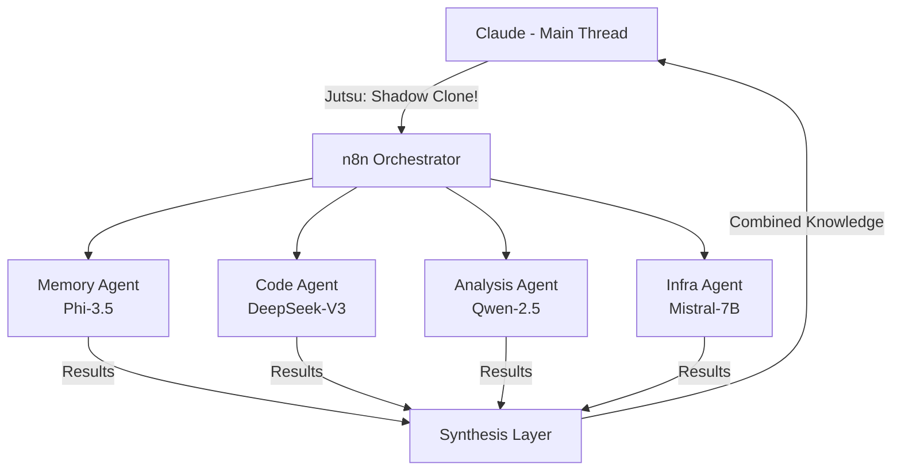

# Shadow Clone Parallelism Architecture

Building on Tool-Combo-Chains (Street Fighter combos), we now introduce **Shadow Clone Parallelism** (Naruto-inspired) for true parallel experimentation.

## Evolution Path

### Level 1: Tool Combos (Current) - 10x
```
Memory → Sequential → Sandbox → Store
       ↓         ↓         ↓
   (sequential execution)
```

### Level 2: Shadow Clones (New) - 100x
```
        ┌→ Clone 1: Memory Agent ─┐
Main ───┼→ Clone 2: Code Agent   ─┼→ Collect → Synthesize
        └→ Clone 3: Analysis Agent┘
           (parallel execution)
```

## Core Concept

Like Naruto's shadow clones that can:
1. **Work independently** on different aspects
2. **Share memories** when dispelled
3. **Multiply force** through parallelism

Our shadow clone agents:
1. **Execute in parallel** via n8n orchestration
2. **Share context** through vector DB
3. **Return results** for synthesis

## Architecture



## Implementation Phases

### Phase 1: Memory Gateway Clone
- Handles all memory operations
- Enforces rules automatically
- No more "edit vs create" mistakes

### Phase 2: Code Sandbox Clone
- Autonomous debugging
- Iterative problem solving
- Returns only solutions

### Phase 3: Full Shadow Clone Network
- Multiple specialized agents
- True ML-style experimentation
- Exponential productivity gains

## Example Workflow

```yaml
name: Shadow Clone Memory Operation
trigger: 
  - webhook from Claude

nodes:
  - name: Memory Clone
    type: vllm-inference
    model: phi-3.5-mini
    prompt: |
      Check if entity exists: {{entity_name}}
      If exists: prepare edit
      If not: create new
      Auto-assign priority based on: {{context}}
      
  - name: Relationship Clone  
    type: vllm-inference
    model: phi-3.5-mini
    prompt: |
      Analyze relationships for: {{entity_name}}
      Create graph connections
      
  - name: Validation Clone
    type: vllm-inference  
    model: phi-3.5-mini
    prompt: |
      Validate all operations
      Check consistency
      
  - name: Synthesis
    type: merge
    inputs: [memory_clone, relationship_clone, validation_clone]
    output: webhook_response
```

## Benefits Over Sequential

| Aspect | Tool Combos (L1) | Shadow Clones (L2) |
|--------|------------------|-------------------|
| Speed | 10x | 100x |
| Parallelism | No | Yes |
| Context Switching | High | None |
| Error Recovery | Manual | Automatic |
| Experimentation | Single path | Multiple paths |

## Next Steps

1. Set up VLLM with multiple models
2. Create n8n shadow clone templates
3. Build shared context vector DB
4. Test with memory operations first
5. Expand to other domains

---

*"When you're at your limit, that's when you need to surpass it with Shadow Clones!"* - Jordan's productivity philosophy
